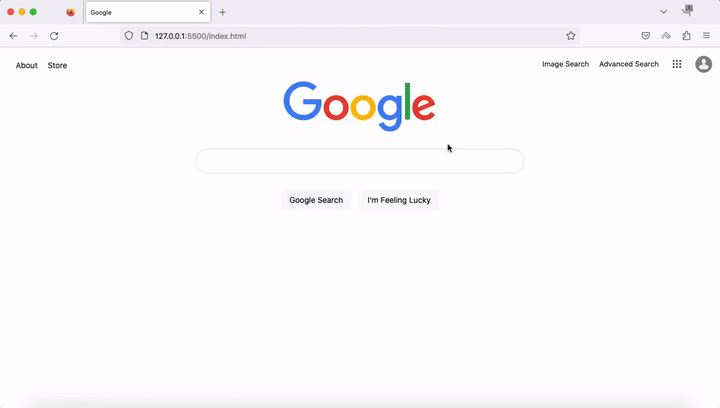
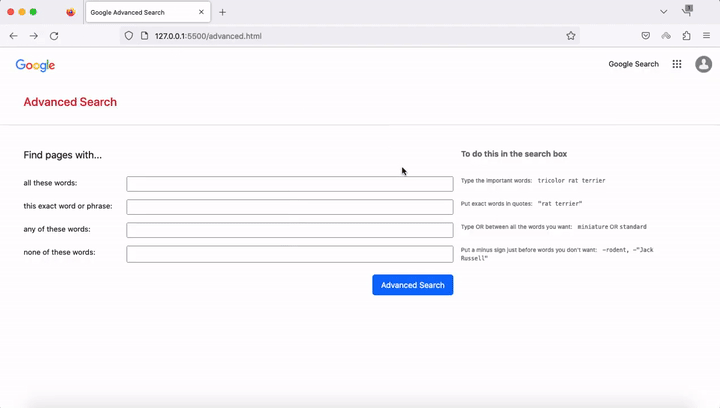

# Google Clone
### [Video Demo](https://www.youtube.com/watch?v=nWRTI7FQlSE&t=33s)
### Description: A front end for Google's search engine. 
# Specification
1. Website should have at least three pages: 
    - [Google Search](./index.html) (which must be called index.html).
    - [Google Image Search](./image.html).
    - [Google Advanced Search](./advanced.html).
2. On the Google Search page, the user should be able to type in a query, click “Google Search”, and be taken to the Google search results for that page.
    - 
3. On the Google Image Search page, the user should be able to type in a query, click a search button, and be taken to the Google Image search results for that page.
    - 
4. On the Google Advanced Search page, the user should be able to provide input for the following four fields: "all these words: ", "this exact word or phrase: ", "any of these words: ", and "none of these words: "
    - 
5. Add an “I’m Feeling Lucky” button to the main Google Search page. Consistent with Google’s own behavior, clicking this link should take users directly to the first Google search result for the query, bypassing the normal results page.
    - 